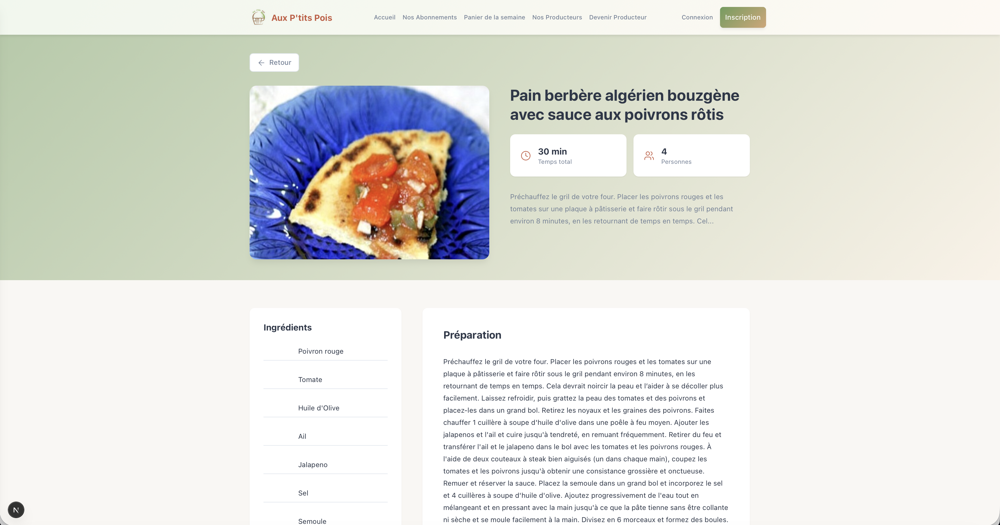
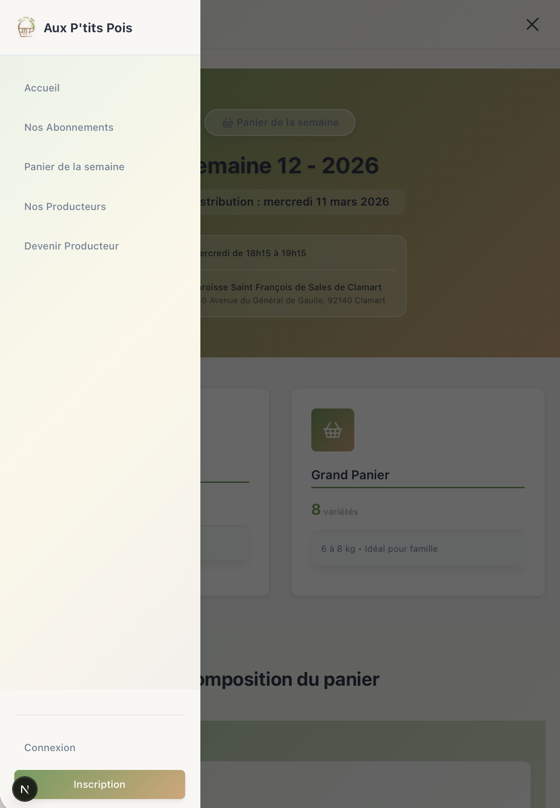
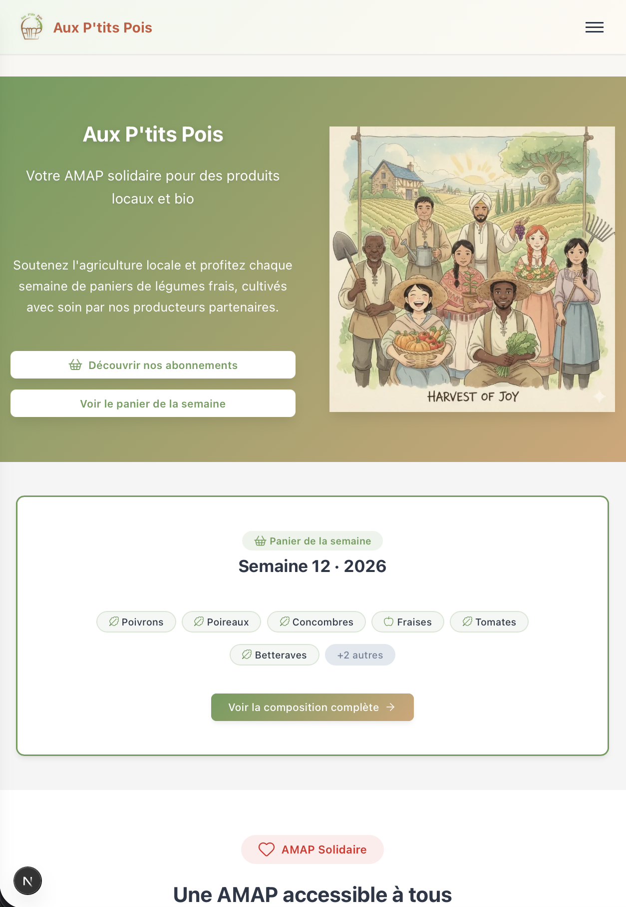
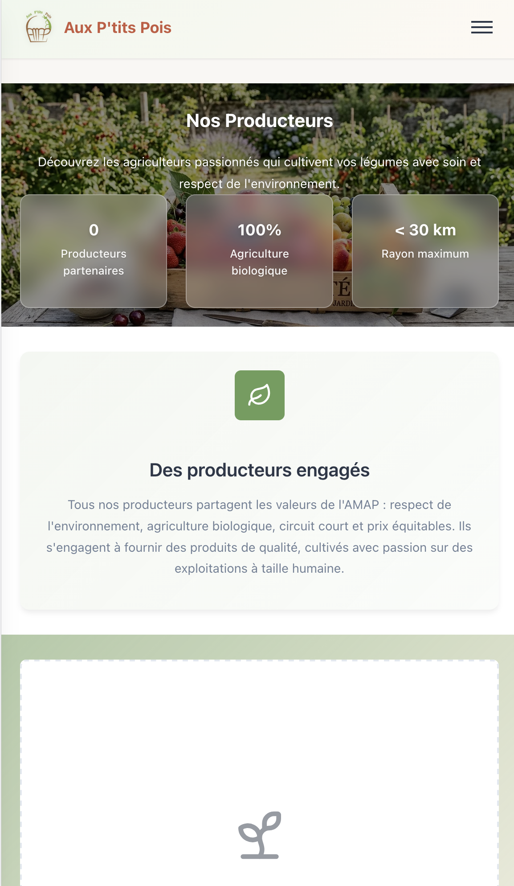
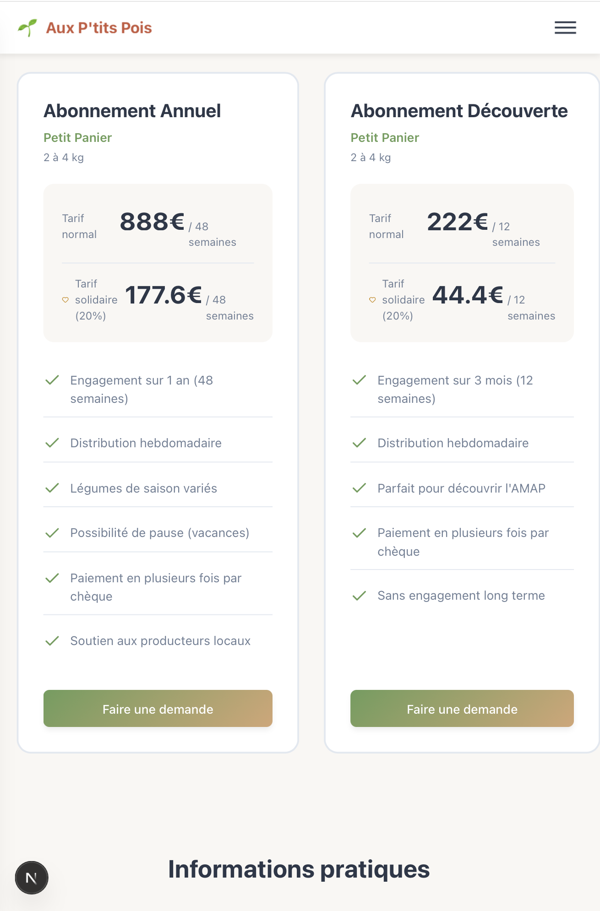
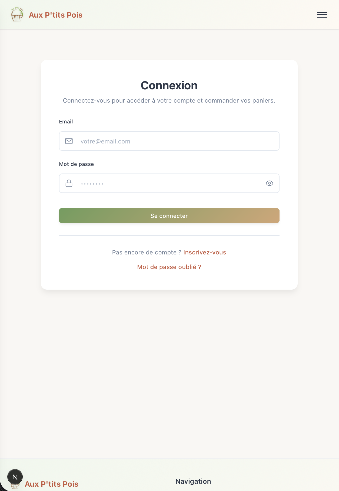
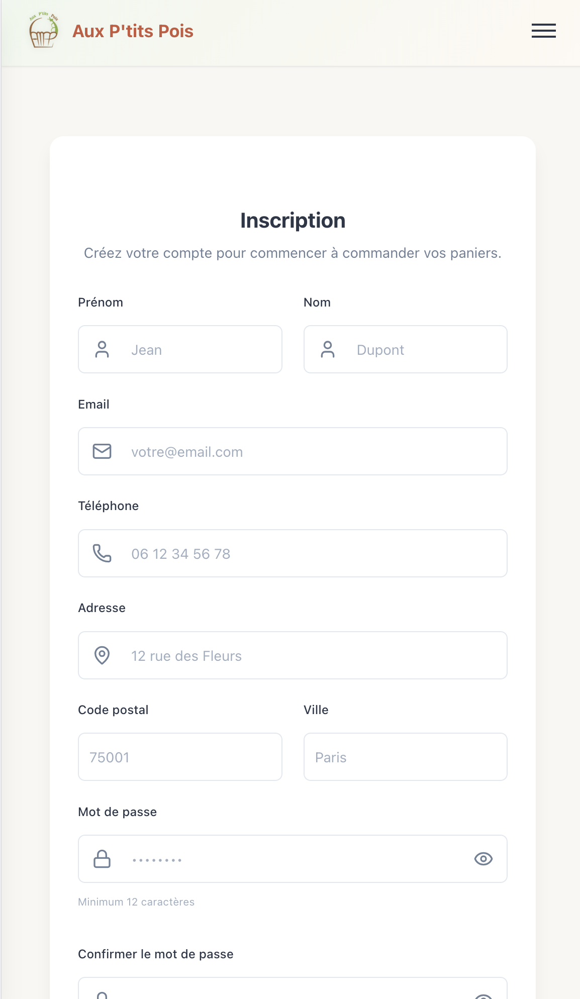

# 🌱 Aux P'tits Pois - Site AMAP

Plateforme web moderne pour la gestion d'une AMAP (Association pour le Maintien d'une Agriculture Paysanne).

## 📸 Aperçu

### Interface publique (Desktop)

*Page d'accueil avec hero section dynamique*


*Liste des producteurs partenaires*


*Page de présentation des abonnements avec tarif solidaire*


*Formulaire d'inscription des nouveaux membres*


*Page de présentation d'une recette*

### Interface mobile responsive

*Navigation mobile avec drawer et animation staggered*


*Page d'accueil optimisée mobile*


*Liste des producteurs en version mobile*


*Abonnements responsive avec cards*


*Formulaire de connexion adapté mobile*


*Inscription simplifiée sur mobile*


## 📋 Description

Ce projet est un site complet permettant de gérer une AMAP de A à Z :
- 🛒 Gestion des paniers hebdomadaires par les ADMIN
- 👥 Gestion des adhérents et abonnements
- 🚜 Présentation des producteurs et produits locaux
- 📅 Organisation des permanences de distribution
- 📧 Communication avec les membres

## 🚀 Technologies utilisées

### Frontend
- **Next.js 15** - Framework React pour le rendu côté serveur
- **React 18** - Interface utilisateur réactive
- **Lucide React** - Icônes modernes
- **CSS natif** - Styling avec variables CSS et responsive design
- **Tarteaucitron.js** - Gestion des cookies conforme RGPD

### Backend
- **Node.js + Express** - Serveur API REST
- **Prisma** - ORM pour la base de données
- **PostgreSQL** - Base de données relationnelle
- **JWT + Bcrypt** - Authentification sécurisée
- **Puppeteer + Handlebars** - Génération de contrats PDF
- **Resend** - Service d'envoi d'emails professionnel
- **TheMealDB API** - Base de données de recettes
- **Google Translate API** - Traduction automatique des recettes en français

## 📁 Structure du projet

```
amap-website/
├── frontend/          # Application Next.js
│   ├── src/
│   │   ├── app/      # Pages et routes
│   │   ├── components/  # Composants réutilisables
│   │   ├── contexts/    # Contextes React (Auth, Modal, etc.)
│   │   ├── lib/         # Utilitaires et API client
│   │   └── styles/      # Fichiers CSS
│   └── public/       # Assets statiques
│
└── backend/          # API Express
    ├── src/
    │   ├── controllers/  # Logique métier
    │   ├── routes/       # Routes API
    │   ├── middlewares/  # Middlewares (auth, erreurs)
    │   ├── services/     # Services (email, PDF)
    │   └── utils/        # Utilitaires
    └── prisma/
        ├── schema.prisma  # Modèle de données
        └── migrations/    # Migrations DB
```

## 🛠️ Installation

### Prérequis
- Node.js 18+
- PostgreSQL
- npm ou yarn

### Étapes

1. **Cloner le projet**
```bash
git clone https://github.com/B-ludovic/amap-website.git
cd amap-website
```

2. **Installation Backend**
```bash
cd backend
npm install

# Créer le fichier .env
cp .env.example .env
# Éditer .env avec vos paramètres :
# - DATABASE_URL (PostgreSQL)
# - JWT_SECRET
# - RESEND_API_KEY (pour l'envoi d'emails)
# - FRONTEND_URL

# Lancer les migrations
npx prisma migrate dev

# Optionnel : remplir avec des données d'exemple
npx prisma db seed
```

3. **Installation Frontend**
```bash
cd ../frontend
npm install

# Créer le fichier .env.local
cp .env.example .env.local
# Éditer .env.local avec l'URL de l'API backend
```

## 🏃 Lancement

### Mode développement

**Depuis la racine (recommandé) :**
```bash
npm run dev
# Lance le backend et le frontend en parallèle
```

**Ou manuellement :**

Terminal 1 - Backend :
```bash
cd backend
npm run dev
# API disponible sur http://localhost:4000
```

Terminal 2 - Frontend :
```bash
cd frontend
npm run dev
# Site disponible sur http://localhost:3000
```

### Mode production

```bash
# Backend
cd backend
npm start

# Frontend
cd frontend
npm run build
npm start
```


## ✨ Fonctionnalités principales

### Pour les adhérents
- ✅ Inscription et création de compte
- ✅ Connexion avec authentification JWT
- ✅ Réinitialisation de mot de passe (forgot password / reset password)
- ✅ Demande d'abonnement (annuel ou découverte)
- ✅ Consultation du panier de la semaine
- ✅ Suggestions de recettes basées sur les légumes du panier
- ✅ Recherche de recettes (par nom ou par ingrédients)
- ✅ Visualisation des producteurs partenaires
- ✅ Gestion du profil
- ✅ Envoi d'emails automatiques (bienvenue, confirmation, etc.)

### Pour les administrateurs
- ✅ Gestion des demandes d'abonnement
- ✅ Génération de contrats d'adhésion en PDF
- ✅ Création des paniers hebdomadaires avec calcul automatique des poids
- ✅ Gestion du stock des produits
- ✅ Organisation des permanences avec assignation de bénévoles
- ✅ Statistiques du tableau de bord
- ✅ Système de thèmes saisonniers - 4 thèmes personnalisables (Printemps, Été, Automne, Hiver)
- ✅ Gestion des points de retrait
- ✅ Distinction des données d'exemple vs données réelles
- ✅ Service d'envoi d'emails avec Resend API
- ✅ Communication par newsletter avec envoi groupé
- ✅ Interface admin complète avec sidebar navigation
- TODO Suivi de la distribution (qui a récupéré son panier)

### Recettes & Cuisine
- ✅ Intégration API TheMealDB (base de données gratuite de recettes)
- ✅ Traduction automatique en français des recettes et ingrédients
- ✅ Suggestions de recettes basées sur le panier hebdomadaire
- ✅ Recherche de recettes par nom (ex: "soupe", "gratin")
- ✅ Recherche de recettes par ingrédients (ex: "tomates, courgettes")
- ✅ Pages dédiées avec liste et détails des recettes
- ✅ Affichage des temps de préparation et nombre de portions

### Design & UX
- ✅ Design responsive (desktop, tablet, mobile)
- ✅ Menu burger mobile avec drawer animé (staggered animation)
- ✅ Cards responsives pour les tableaux admin (≤992px)
- ✅ Dégradé pastel sur navigation mobile
- ✅ Thèmes saisonniers avec changement dynamique des couleurs
- ✅ Animations fluides et transitions CSS
- ✅ Icônes Lucide React modernes
- ✅ États de chargement et messages de confirmation
- ✅ Bandeau de cookies RGPD (accept/refuser/personnaliser)

### Conformité & Sécurité
- ✅ Gestion des cookies conforme RGPD avec Tarteaucitron.js
- ✅ Authentification JWT + hachage des mots de passe (bcrypt)
- ✅ Protection des routes avec middlewares de rôles (MEMBER, VOLUNTEER, ADMIN)
- ✅ Rate limiting sur les endpoints sensibles (login, reset password, PDF)
- ✅ Headers HTTP sécurisés (Helmet.js)
- ✅ Taille des requêtes limitée (body limit 100kb)

## 📊 Base de données

Le schéma Prisma comprend :
- **Users** - Utilisateurs (membres, bénévoles, admins)
- **Subscriptions** - Abonnements aux paniers
- **WeeklyBaskets** - Paniers hebdomadaires
- **Products** - Produits avec gestion du stock
- **Producers** - Producteurs locaux
- **Shifts** - Permanences de distribution
- **Newsletters** - Communications
- Et plus...

## 🎨 Personnalisation

### Thèmes saisonniers
Le site propose un système de thèmes dynamiques qui s'adaptent aux saisons. Les administrateurs peuvent :
- Choisir parmi 4 thèmes prédéfinis (Printemps, Été, Automne, Hiver)
- Personnaliser les couleurs de chaque thème
- Activer le thème de leur choix instantanément

Les thèmes modifient automatiquement :
- Les couleurs principales et secondaires
- Les dégradés des bannières
- Les boutons et éléments interactifs
- La couleur d'arrière-plan

### Variables CSS
Les couleurs et styles sont centralisés dans `frontend/src/styles/variables.css` :
```css
--primary-color: #6b9d5a;      /* Couleur primaire */
--secondary-color: #d4a574;    /* Couleur secondaire */
--accent-color: #c85a3f;       /* Couleur d'accent */
--background-color: #f9f7f4;   /* Arrière-plan */
--gradient-button: linear-gradient(135deg, var(--primary-color) 0%, var(--secondary-color) 100%);
```

Les thèmes sont stockés en base de données et appliqués dynamiquement via le `ThemeProvider` React.

## 📝 Scripts disponibles

### Racine
- `npm run dev` - Lance le backend et le frontend en parallèle

### Backend
- `npm run dev` - Lance le serveur en mode développement
- `npm start` - Lance le serveur en production
- `npx prisma studio` - Interface graphique pour la DB
- `npx prisma migrate dev` - Crée une nouvelle migration

### Frontend
- `npm run dev` - Lance Next.js en développement
- `npm run build` - Build de production
- `npm start` - Serveur de production
- `npm run postinstall` - Copie les fichiers Tarteaucitron (automatique après npm install)

## 🐛 Débogage

**Problème de connexion à la DB :**
- Vérifiez que PostgreSQL est démarré
- Vérifiez la variable `DATABASE_URL` dans `.env`

**Erreurs CORS :**
- Vérifiez que `FRONTEND_URL` dans `.env` backend correspond à l'URL du frontend

**Erreurs d'authentification :**
- Vérifiez que `JWT_SECRET` est défini dans `.env`

## 📄 Licence

Ce projet est développé pour une AMAP locale. Tous droits réservés.

## Crédits

- **Icônes** : [Flaticon](https://www.flaticon.com)

## 🤝 Contribution

Projet en développement actif. Pour toute question ou suggestion :
- Ouvrir une issue sur GitHub
- Contacter l'équipe de développement

---

Fait avec ❤️ pour promouvoir l'agriculture locale et les circuits courts

Ludovic
