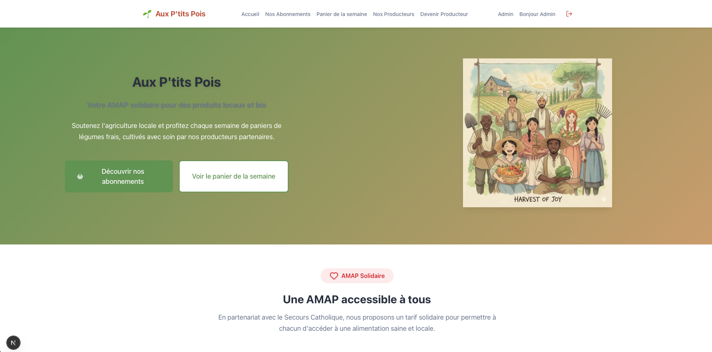
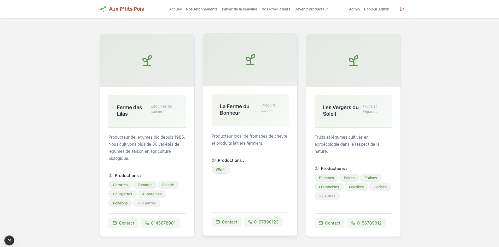
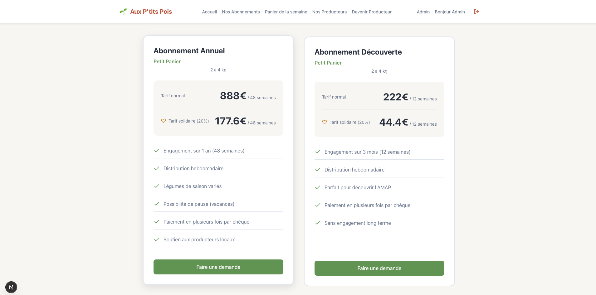
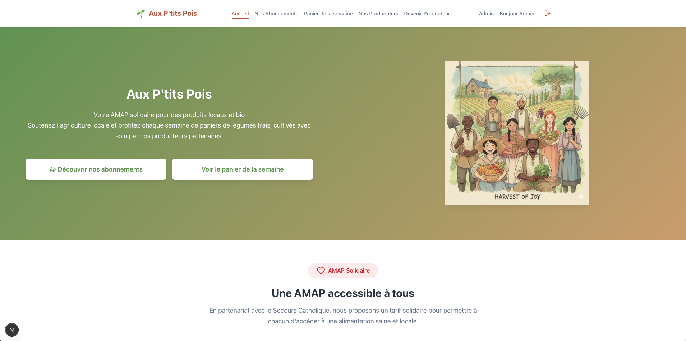
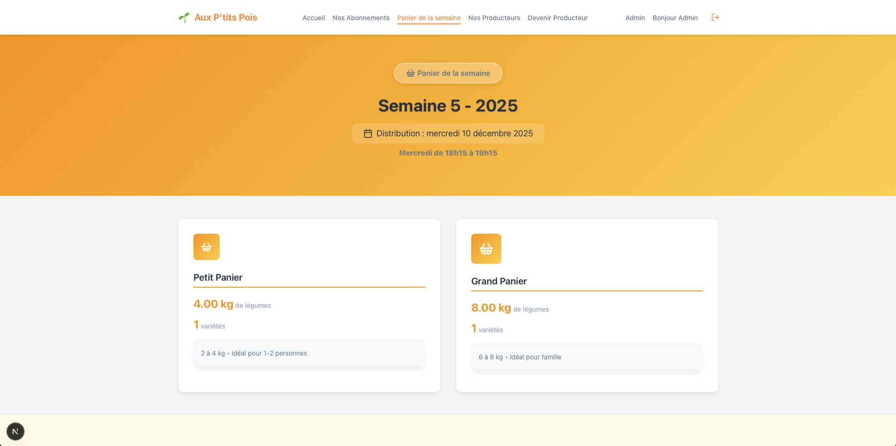
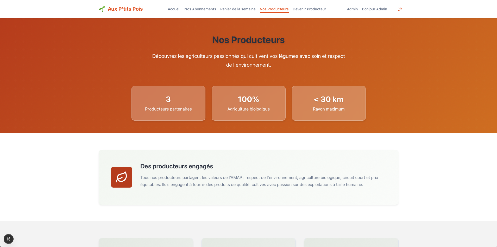
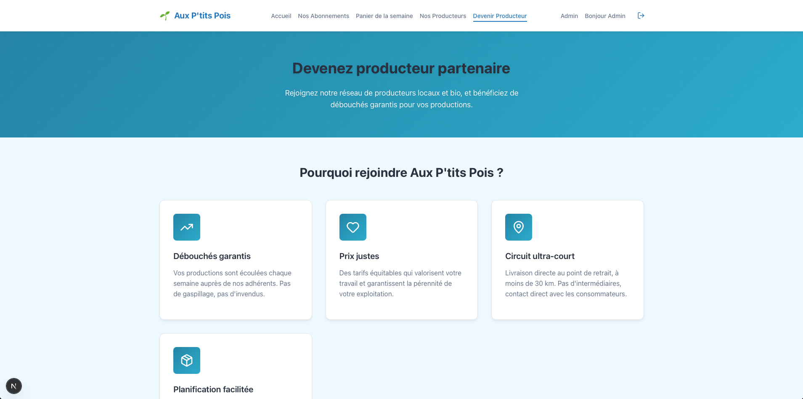

# 🌱 Aux P'tits Pois - Site AMAP

Plateforme web moderne pour la gestion d'une AMAP (Association pour le Maintien d'une Agriculture Paysanne).

## 📸 Aperçu

### Interface publique

*Page d'accueil avec hero section dynamique*


*Liste des producteurs partenaires*


*Page de présentation des abonnements avec tarif solidaire*


*Formulaire d'inscription des nouveaux membres*

### Thèmes saisonniers
Le site propose 4 thèmes qui s'adaptent aux saisons :


*Thème Printemps - Tons verts et naturels*


*Thème Été - Couleurs chaudes et lumineuses*


*Thème Automne - Palette douce et chaleureuse*


*Thème Hiver - Nuances douces et apaisantes*


## 📋 Description

Ce projet est un site complet permettant de gérer une AMAP de A à Z :
- 🛒 gestion des paniers hebdomadaires par les ADMIN
- 👥 Gestion des adhérents et abonnements
- 🚜 Présentation des producteurs et produits locaux
- 📅 Organisation des permanences de distribution
- 📧 Communication avec les membres

## 🚀 Technologies utilisées

### Frontend
- **Next.js 14** - Framework React pour le rendu côté serveur
- **React** - Interface utilisateur réactive
- **Lucide React** - Icônes modernes
- **CSS natif** - Styling avec variables CSS

### Backend
- **Node.js + Express** - Serveur API REST
- **Prisma** - ORM pour la base de données
- **PostgreSQL** - Base de données relationnelle
- **JWT** - Authentification sécurisée

## 📁 Structure du projet

```
amap-website/
├── frontend/          # Application Next.js
│   ├── src/
│   │   ├── app/      # Pages et routes
│   │   ├── components/  # Composants réutilisables
│   │   ├── contexts/    # Contextes React (Auth, Modal, etc.)
│   │   ├── lib/         # Utilitaires et API client
│   │   └── styles/      # Fichiers CSS
│   └── public/       # Assets statiques
│
└── backend/          # API Express
    ├── src/
    │   ├── controllers/  # Logique métier
    │   ├── routes/       # Routes API
    │   ├── middlewares/  # Middlewares (auth, erreurs)
    │   ├── services/     # Services (email, stripe)
    │   └── utils/        # Utilitaires
    └── prisma/
        ├── schema.prisma  # Modèle de données
        └── migrations/    # Migrations DB
```

## 🛠️ Installation

### Prérequis
- Node.js 18+ 
- PostgreSQL
- npm ou yarn

### Étapes

1. **Cloner le projet**
```bash
git clone https://github.com/B-ludovic/amap-website.git
cd amap-website
```

2. **Installation Backend**
```bash
cd backend
npm install

# Créer le fichier .env
cp .env.example .env
# Éditer .env avec vos paramètres (DB, JWT_SECRET, etc.)

# Lancer les migrations
npx prisma migrate dev

# Optionnel : remplir avec des données d'exemple
npx prisma db seed
```

3. **Installation Frontend**
```bash
cd ../frontend
npm install

# Créer le fichier .env.local
cp .env.example .env.local
# Éditer .env.local avec l'URL de l'API backend
```

## 🏃 Lancement

### Mode développement

**Terminal 1 - Backend :**
```bash
cd backend
npm run dev
# API disponible sur http://localhost:4000
```

**Terminal 2 - Frontend :**
```bash
cd frontend
npm run dev
# Site disponible sur http://localhost:3000
```

### Mode production

```bash
# Backend
cd backend
npm run build
npm start

# Frontend
cd frontend
npm run build
npm start
```

## 👤 Comptes par défaut

Après avoir lancé le seed, vous pouvez vous connecter avec :

**Admin :**
- Email : `admin@amap.com`
- Mot de passe : `admin123`

**Membre :**
- Email : `membre@amap.com`
- Mot de passe : `membre123`

## ✨ Fonctionnalités principales

### Pour les adhérents
- ✅ Inscription et création de compte
- ✅ Demande d'abonnement (annuel ou découverte)
- ✅ Consultation du panier de la semaine
- ✅ Visualisation des producteurs partenaires
- ✅ Gestion du profil

### Pour les administrateurs
- ✅ Gestion des demandes d'abonnement
- ✅ Création des paniers hebdomadaires avec calcul automatique des poids
- ✅ Gestion du stock des produits
- ✅ Organisation des permanences avec assignation de bénévoles
- ✅ Statistiques du tableau de bord
- ✅ Système de thèmes saisonniers - 4 thèmes personnalisables (Printemps, Été, Automne, Hiver)
- ✅ Gestion des points de retrait
- ✅ Distinction des données d'exemple vs données réelles
- TODO Suivi de la distribution (qui a récupéré son panier)
- TODO Communication par newsletter

## 📊 Base de données

Le schéma Prisma comprend :
- **Users** - Utilisateurs (membres, bénévoles, admins)
- **Subscriptions** - Abonnements aux paniers
- **WeeklyBaskets** - Paniers hebdomadaires
- **Products** - Produits avec gestion du stock
- **Producers** - Producteurs locaux
- **Shifts** - Permanences de distribution
- **Newsletters** - Communications
- Et plus...

## 🎨 Personnalisation

### Thèmes saisonniers
Le site propose un système de thèmes dynamiques qui s'adaptent aux saisons. Les administrateurs peuvent :
- Choisir parmi 4 thèmes prédefinis (Printemps, Été, Automne, Hiver)
- Personnaliser les couleurs de chaque thème
- Activer le thème de leur choix instantanément

Les thèmes modifient automatiquement :
- Les couleurs principales et secondaires
- Les dégradés des bannières
- Les boutons et éléments interactifs
- La couleur d'arrière-plan

### Variables CSS
Les couleurs et styles sont centralisés dans `frontend/src/styles/variables.css` :
```css

--primary-color: #6b9d5a;      - Couleur primaire 
--secondary-color: #d4a574;    - Couleur secondaire
--accent-color: #c85a3f;       - Couleur d'accent
--background-color: #f9f7f4;   - Arriere plan
--gradient-button: linear-gradient(135deg, var(--primary-color) 0%, var(--secondary-color) 100%);
```

Les thèmes sont stockés en base de données et appliqués dynamiquement via le `ThemeProvider` React.

## 📝 Scripts disponibles

### Backend
- `npm run dev` - Lance le serveur en mode développement
- `npm start` - Lance le serveur en production
- `npx prisma studio` - Interface graphique pour la DB
- `npx prisma migrate dev` - Crée une nouvelle migration

### Frontend
- `npm run dev` - Lance Next.js en développement
- `npm run build` - Build de production
- `npm start` - Serveur de production

## 🐛 Débogage

**Problème de connexion à la DB :**
- Vérifiez que PostgreSQL est démarré
- Vérifiez la variable `DATABASE_URL` dans `.env`

**Erreurs CORS :**
- Vérifiez que `FRONTEND_URL` dans `.env` backend correspond à l'URL du frontend

**Erreurs d'authentification :**
- Vérifiez que `JWT_SECRET` est défini dans `.env`

## 📄 Licence

Ce projet est développé pour une AMAP locale. Tous droits réservés.

## Crédits

- **Icônes** : [Flaticon](https://www.flaticon.com)

## 🤝 Contribution

Projet en développement actif. Pour toute question ou suggestion :
- Ouvrir une issue sur GitHub
- Contacter l'équipe de développement

---

Fait avec ❤️ pour promouvoir l'agriculture locale et les circuits courts

Ludovic 
