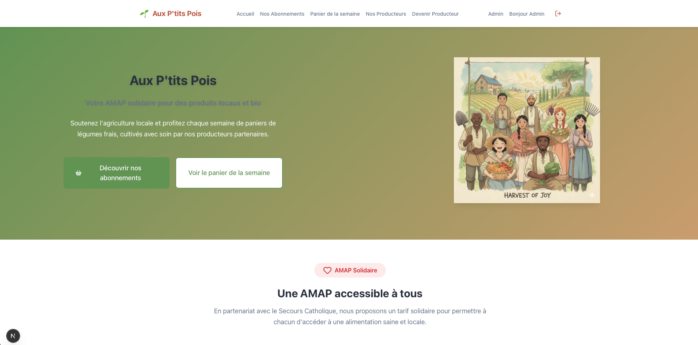
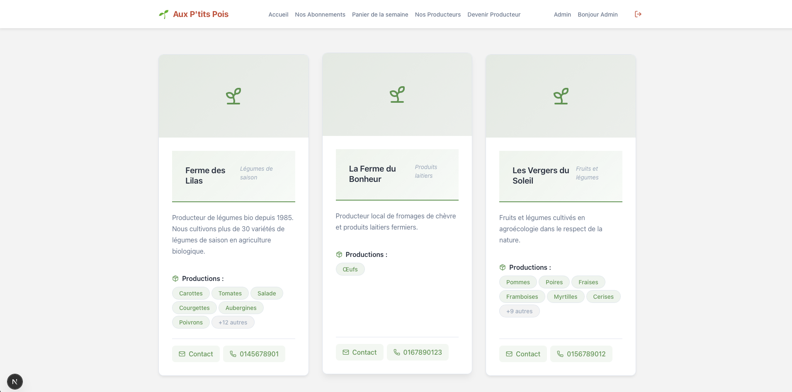
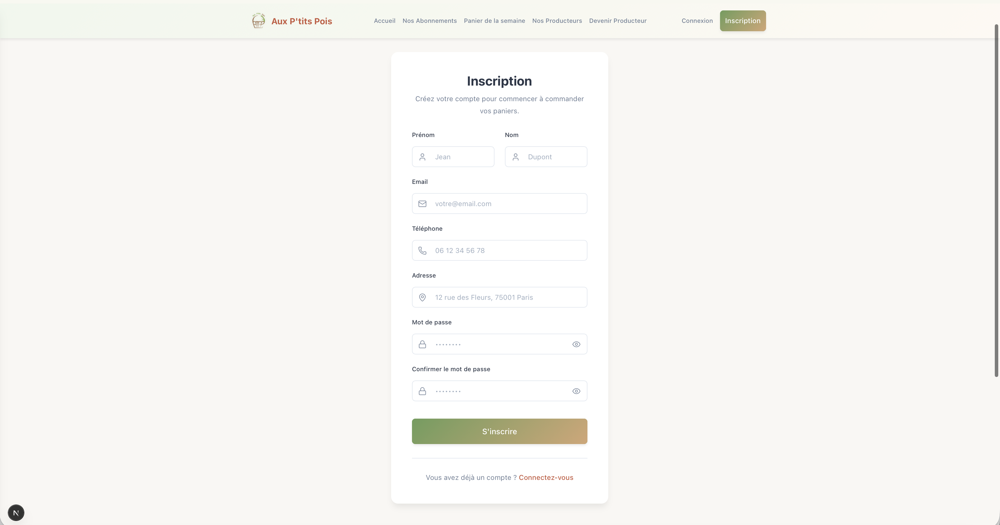
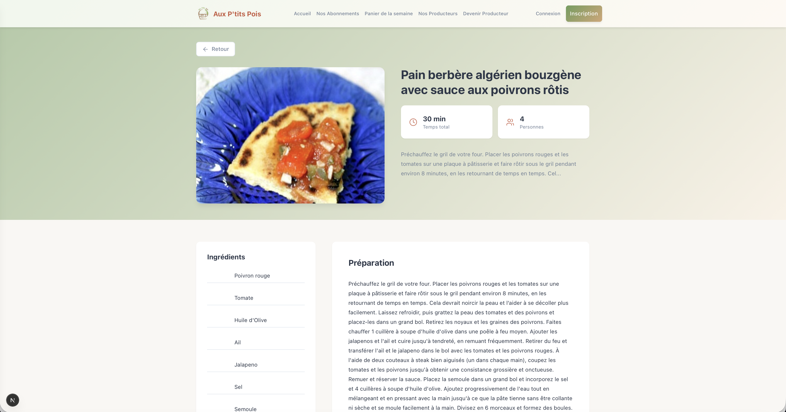
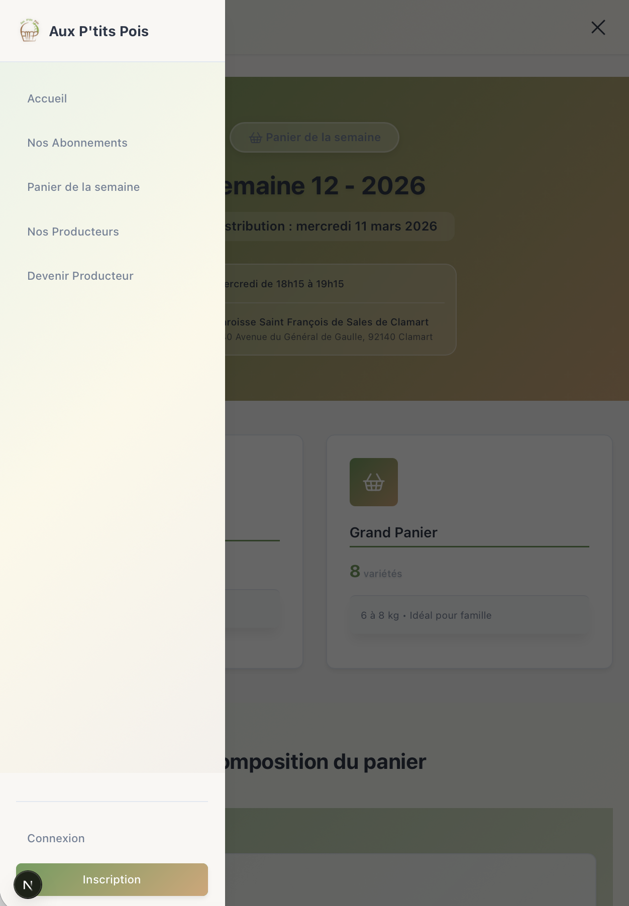
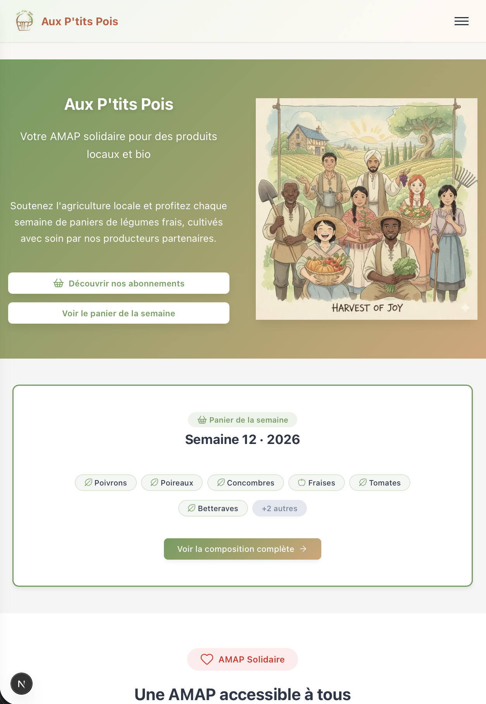
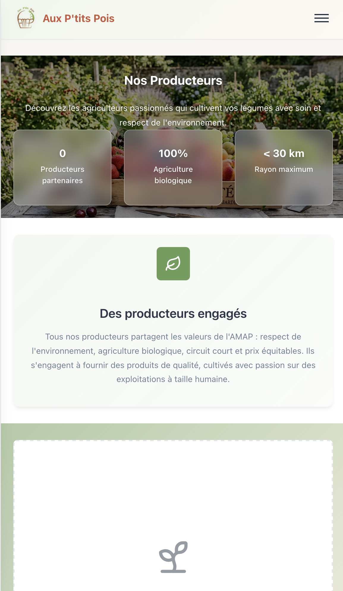
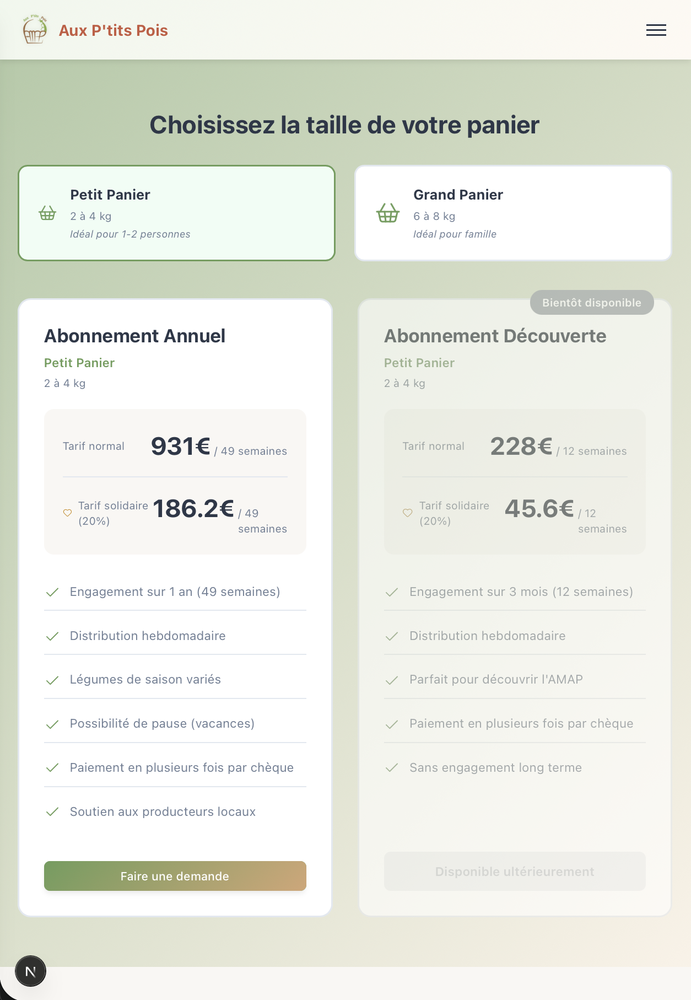
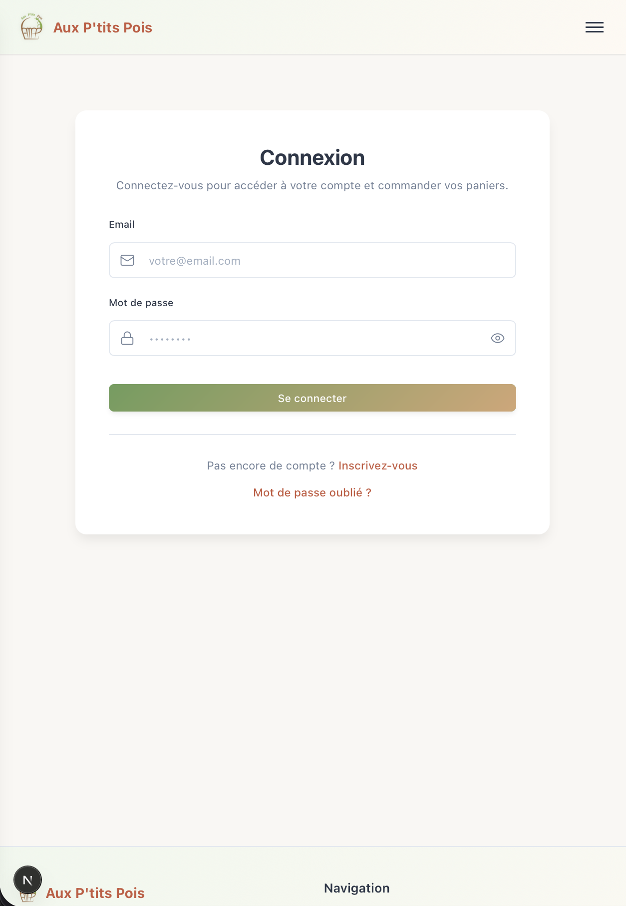
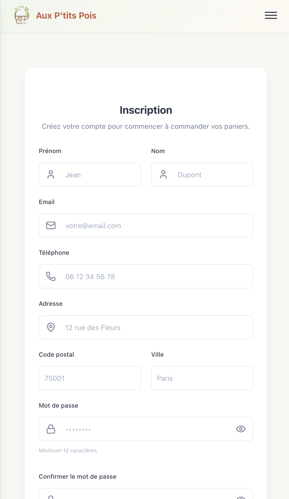

# 🫛 Aux P'tits Pois - Site AMAP

Plateforme web moderne pour la gestion d'une AMAP (Association pour le Maintien d'une Agriculture Paysanne).

## 📸 Aperçu

### Interface publique (Desktop)






### Interface mobile responsive







## 📋 Description

Ce projet est un site complet permettant de gérer une AMAP de A à Z :
- 🛒 Gestion des paniers hebdomadaires par les ADMIN
- 👥 Gestion des adhérents et abonnements
- 🚜 Présentation des producteurs et produits locaux
- 📅 Organisation des permanences de distribution
- 📧 Communication avec les membres

## 🚀 Technologies utilisées

### Frontend
- **Next.js 15** - Framework React pour le rendu côté serveur (SSR, sitemap, robots.txt natifs)
- **React 18** - Interface utilisateur réactive
- **Lucide React** - Icônes modernes
- **CSS natif** - Styling avec variables CSS et responsive design
- **Tiptap** - Éditeur rich-text (gras, italique, titres, listes, séparateur)
- **isomorphic-dompurify** - Sanitisation XSS du contenu HTML externe
- **Orejime** - Gestion des cookies conforme RGPD

### Backend
- **Node.js + Express** - Serveur API REST
- **Prisma** - ORM pour la base de données
- **PostgreSQL** - Base de données relationnelle
- **JWT + Bcrypt** - Authentification sécurisée
- **Zod** - Validation des entrées avec schémas centralisés
- **Puppeteer + Handlebars** - Génération de contrats PDF
- **Nodemailer + Brevo SMTP** - Service d'envoi d'emails professionnel
- **isomorphic-dompurify** - Sanitisation XSS des emails (contact, newsletter)
- **TheMealDB API** - Base de données de recettes
- **google-translate-api-x** - Traduction automatique des recettes en français (sans clé API)

## 📁 Structure du projet

```
amap-website/
├── frontend/          # Application Next.js
│   ├── src/
│   │   ├── app/      # Pages et routes
│   │   ├── components/  # Composants réutilisables
│   │   ├── contexts/    # Contextes React (Auth, Modal, etc.)
│   │   ├── lib/         # Utilitaires et API client
│   │   └── styles/      # Fichiers CSS
│   └── public/       # Assets statiques
│
└── backend/          # API Express
    ├── src/
    │   ├── controllers/  # Logique métier
    │   ├── routes/       # Routes API
    │   ├── middlewares/  # Middlewares (auth, erreurs)
    │   ├── services/     # Services (email, PDF)
    │   └── utils/        # Utilitaires
    └── prisma/
        ├── schema.prisma  # Modèle de données
        └── migrations/    # Migrations DB
```

## 🛠️ Installation

### Prérequis
- Node.js 18+
- PostgreSQL
- npm ou yarn

### Étapes

1. **Cloner le projet**
```bash
git clone https://github.com/B-ludovic/amap-website.git
cd amap-website
```

2. **Installation Backend**
```bash
cd backend
npm install

# Créer le fichier .env
cp .env.example .env
# Éditer .env avec vos paramètres :
# - DATABASE_URL (PostgreSQL)
# - JWT_SECRET
# - BREVO_SMTP_USER (login SMTP Brevo)
# - BREVO_SMTP_KEY (clé SMTP Brevo)
# - FRONTEND_URL

# Lancer les migrations
npx prisma migrate dev

# Optionnel : remplir avec des données d'exemple
npx prisma db seed
```

3. **Installation Frontend**
```bash
cd ../frontend
npm install

# Créer le fichier .env.local
cp .env.example .env.local
# Éditer .env.local avec l'URL de l'API backend
```

## 🏃 Lancement

### Mode développement

**Depuis la racine (recommandé) :**
```bash
npm run dev
# Lance le backend et le frontend en parallèle
```

**Ou manuellement :**

Terminal 1 - Backend :
```bash
cd backend
npm run dev
# API disponible sur http://localhost:4000
```

Terminal 2 - Frontend :
```bash
cd frontend
npm run dev
# Site disponible sur http://localhost:3000
```

### Mode production

```bash
# Backend
cd backend
npm start

# Frontend
cd frontend
npm run build
npm start
```

## ☁️ Déploiement

Le projet est déployé en production sur :

- **Frontend → [Vercel](https://vercel.com)** : déploiement automatique depuis GitHub, HTTPS inclus.
  - URL : https://auxptitspois.fr
- **Backend + Base de données → [Render](https://render.com)** : service Web pour l'API Express et base PostgreSQL managée.
  - URL : https://api.auxptitspois.fr

### Variables d'environnement à configurer

**Sur Render (backend) :**
```
DATABASE_URL=...           # fournie automatiquement par Render PostgreSQL
JWT_SECRET=...
NODE_ENV=production
FRONTEND_URL=https://auxptitspois.fr
BREVO_SMTP_USER=...        # login SMTP Brevo (Settings → SMTP et API)
BREVO_SMTP_KEY=...         # clé SMTP Brevo
```

**Sur Vercel (frontend) :**
```
NEXT_PUBLIC_API_URL=https://api.auxptitspois.fr
NEXT_PUBLIC_GA_ID=...          # ID Google Analytics (ex: G-XXXXXXXXXX)
```

> Sur Render en version gratuite, le backend se met en veille après 15 min d'inactivité. Première requête un peu lente, c'est normal.

## ✨ Fonctionnalités principales

### Pour les adhérents
- Inscription, connexion JWT, réinitialisation de mot de passe
- Demande d'abonnement en ligne (choix panier, tarification, modalité de paiement)
- Consultation du panier de la semaine avec horaire et adresse de retrait
- Suggestions et recherche de recettes basées sur les légumes du panier
- Visualisation des producteurs partenaires
- Gestion du profil, vérification d'email
- Export des données personnelles (RGPD art. 20)
- Suppression du compte (RGPD art. 17)

### Pour les administrateurs
- Gestion des demandes, abonnements (activation, résiliation, pause individuelle)
- Fermetures collectives de l'AMAP avec newsletter automatique
- Génération de contrats PDF pré-remplis (Puppeteer + Handlebars)
- Création des paniers hebdomadaires avec calcul automatique
- Notification email automatique aux abonnés actifs à la publication du panier (envoi groupé par batch)
- Export CSV de la liste de distribution (compatible Excel, encodage UTF-8 BOM)
- Gestion des candidatures producteurs avec emails d'acceptation/refus
- Gestion des produits, permanences, points de retrait
- Tableau de bord avec statistiques
- Envoi de newsletters (rich-text Tiptap, envoi groupé, programmation, brouillons)
- Gestion des messages de contact (statut lu/non-lu/archivé)
- Système de thèmes saisonniers (Printemps, Été, Automne, Hiver)

### Recettes & Cuisine
- Intégration API TheMealDB avec traduction automatique en français (google-translate-api-x)
- Dictionnaire de faux amis FR→EN pour les légumes courants (courgette→zucchini, etc.)
- Priorité aux recettes françaises dans tous les résultats (search et suggestions panier)
- Recherche par nom ou par ingrédients
- Pilules légumes saisonnières cliquables (Printemps / Été / Automne / Hiver) avec icônes SVG OpenMoji
- Pages dédiées avec liste et détail des recettes

### Design & Sécurité
- Design responsive (desktop, tablet, mobile) avec thèmes saisonniers dynamiques
- Authentification JWT + bcrypt, protection des routes par rôle (MEMBER, VOLUNTEER, ADMIN)
- Rate limiting global, headers sécurisés (Helmet.js), sanitisation XSS (DOMPurify)
- Gestion des cookies conforme RGPD (Orejime)
- Purge automatique des données : comptes supprimés (90j), inscriptions non vérifiées (30j)
- SEO : sitemap, robots.txt (noindex admin + blocage bots IA), schema FAQPage JSON-LD, lazy loading images
- Emails transactionnels complets : permanences, désistements, abonnements, paniers, candidatures producteurs

## 📊 Base de données

Le schéma Prisma comprend :
- **Users** - Utilisateurs (membres, bénévoles, admins)
- **Subscriptions** - Abonnements aux paniers
- **SubscriptionPause** - Pauses individuelles (limite 2 semaines/an)
- **AmapClosure** - Fermetures collectives (limite 3 semaines/an)
- **SubscriptionRequests** - Demandes d'abonnement
- **WeeklyBaskets** - Paniers hebdomadaires
- **WeeklyPickup** - Suivi des retraits
- **Products** - Produits avec gestion du stock
- **Producers** - Producteurs locaux
- **Shifts** - Permanences de distribution
- **Newsletters** - Communications
- **ContactMessage** - Messages de contact

## 🎨 Personnalisation

Les administrateurs peuvent choisir parmi 4 thèmes saisonniers prédéfinis (Printemps, Été, Automne, Hiver) et personnaliser leurs couleurs. Les thèmes sont stockés en base de données et appliqués dynamiquement via le `ThemeProvider` React.

Les couleurs et styles sont centralisés dans `frontend/src/styles/variables.css`.

## 📝 Scripts disponibles

### Racine
- `npm run dev` - Lance le backend et le frontend en parallèle

### Backend
- `npm run dev` - Lance le serveur en mode développement
- `npm start` - Lance le serveur en production
- `npx prisma studio` - Interface graphique pour la DB
- `npx prisma migrate dev` - Crée une nouvelle migration
- `node scripts/create-admin.js` - Crée le premier compte admin en production
- `node prisma/migrate-theme-colors.js` - Met à jour les couleurs de thème en base (WCAG AA)

### Frontend
- `npm run dev` - Lance Next.js en développement
- `npm run build` - Build de production
- `npm start` - Serveur de production
- `npm run postinstall` - Copie les fichiers Orejime dans public/ (automatique après npm install)

## 🐛 Débogage

**Problème de connexion à la DB :**
- Vérifiez que PostgreSQL est démarré
- Vérifiez la variable `DATABASE_URL` dans `.env`

**Erreurs CORS :**
- Vérifiez que `FRONTEND_URL` dans `.env` backend correspond à l'URL du frontend

**Erreurs d'authentification :**
- Vérifiez que `JWT_SECRET` est défini dans `.env`

## 📄 Licence

Ce projet est développé pour une AMAP locale. Tous droits réservés.

## Crédits

- **Icônes légumes** : [OpenMoji](https://openmoji.org) — licence [CC BY-SA 4.0](https://creativecommons.org/licenses/by-sa/4.0/)
- **Icônes UI** : [Lucide React](https://lucide.dev)

---

Fait avec ❤️ pour promouvoir l'agriculture locale et les circuits courts

Ludovic
