# 🫛 Aux P'tits Pois - Site AMAP

Plateforme web moderne pour la gestion d'une AMAP (Association pour le Maintien d'une Agriculture Paysanne).

## 📸 Aperçu

### Interface publique (Desktop)
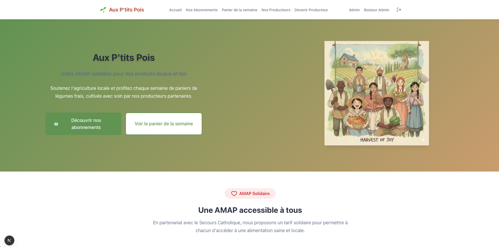
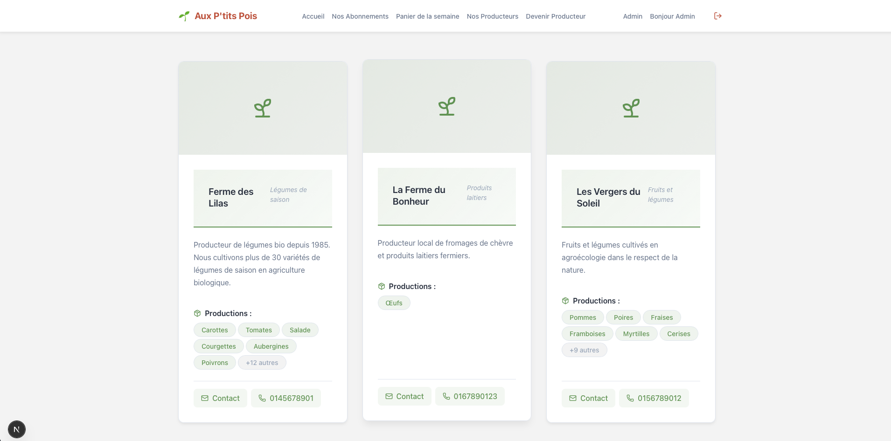

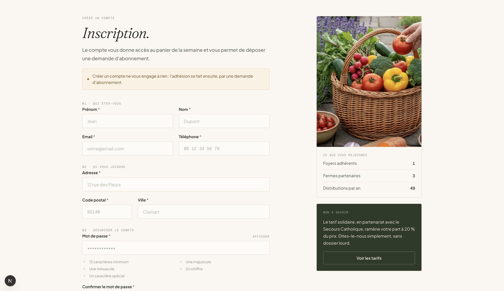
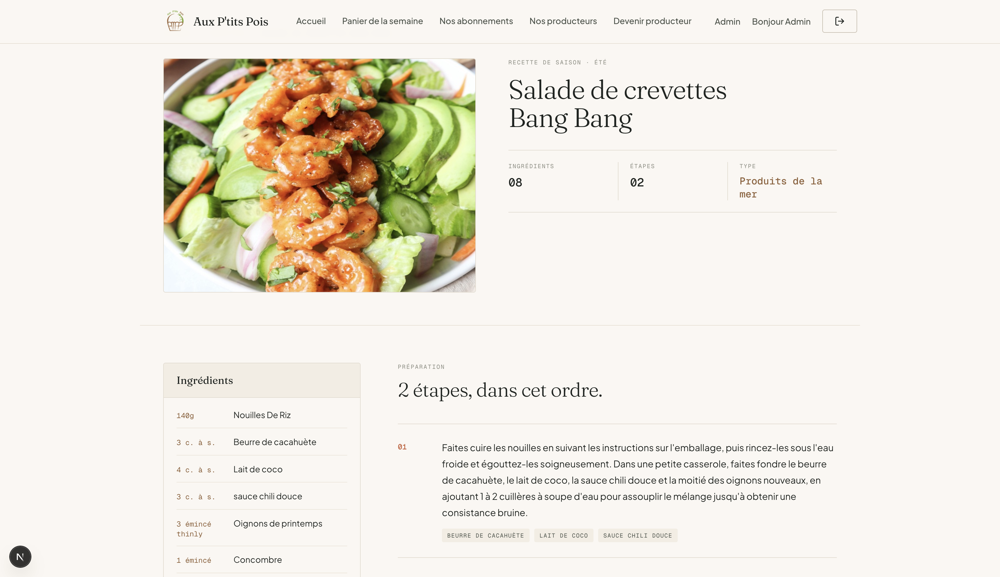

### Thèmes saisonniers
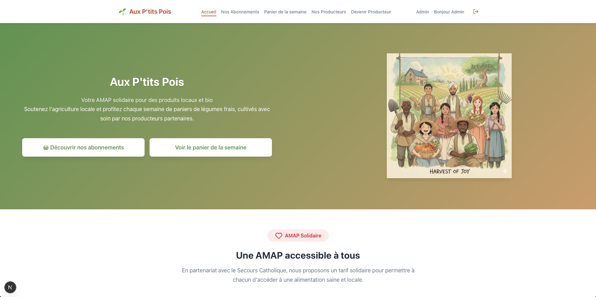
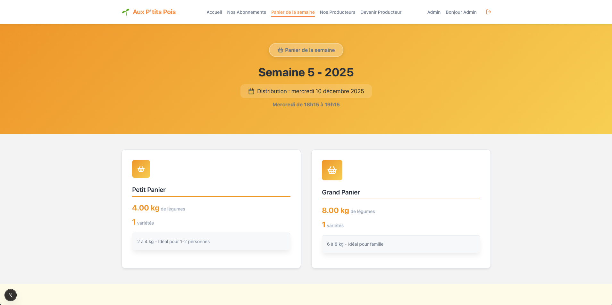
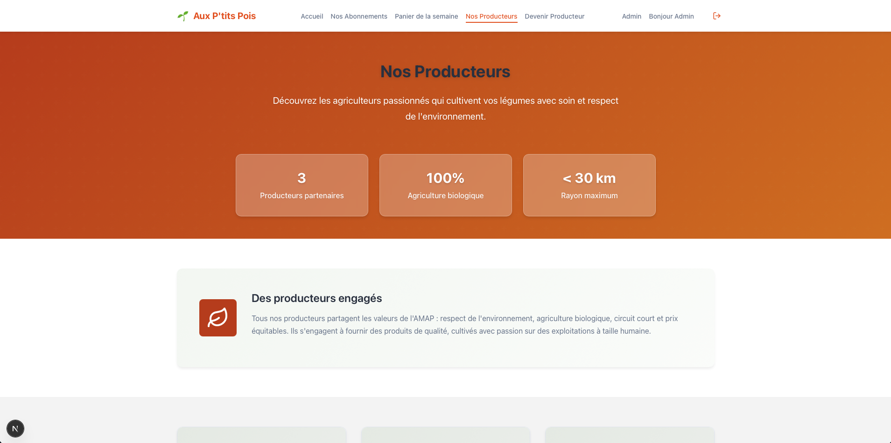
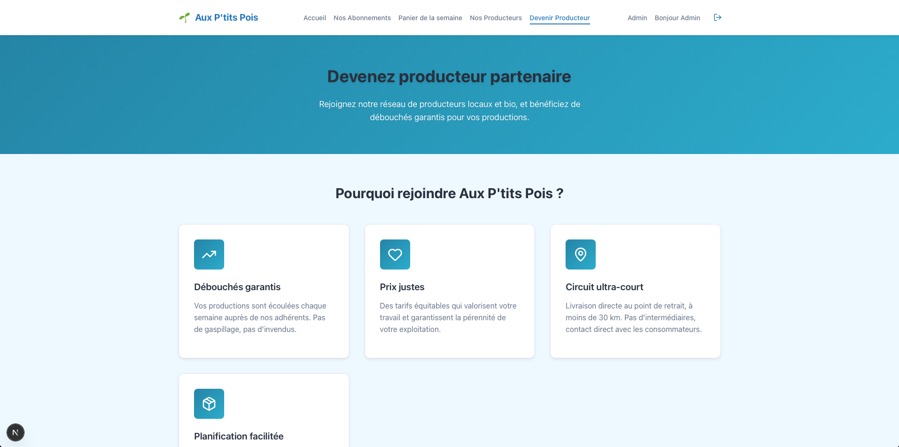

### Interface mobile responsive
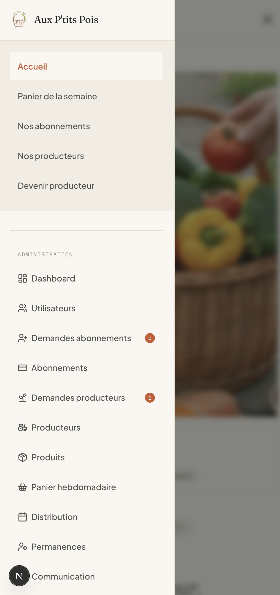
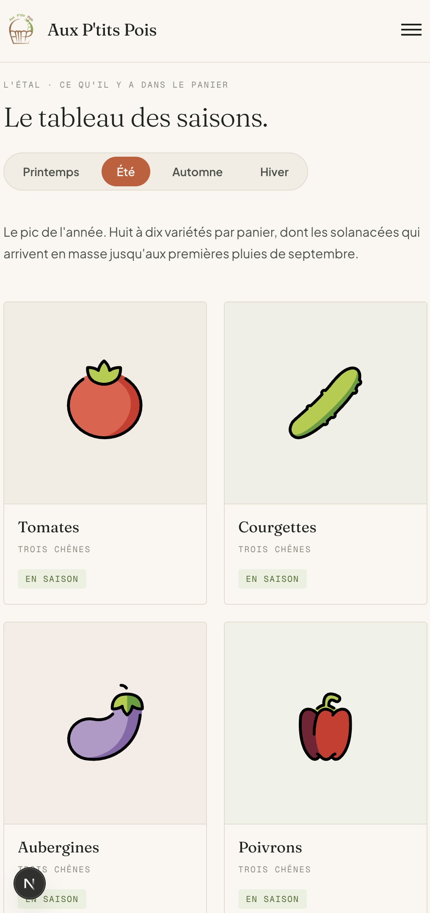
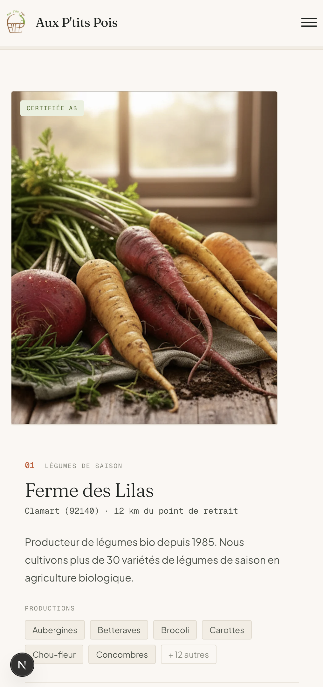
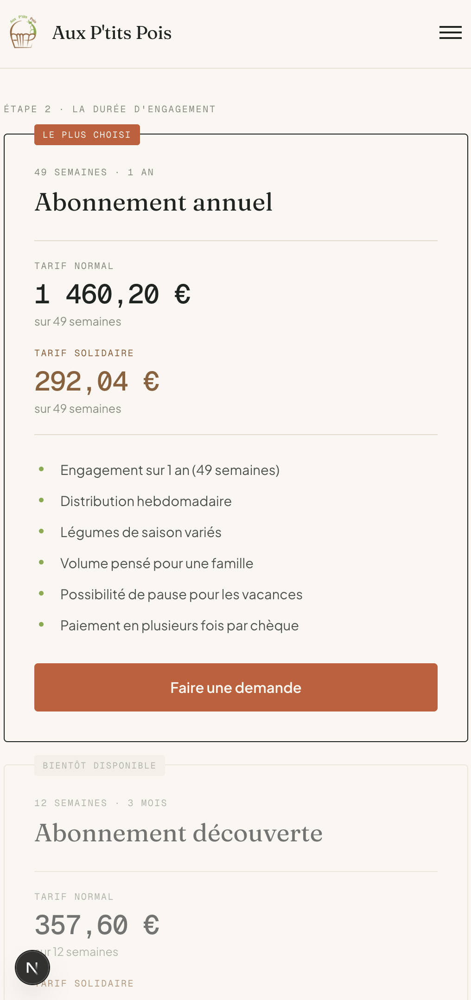
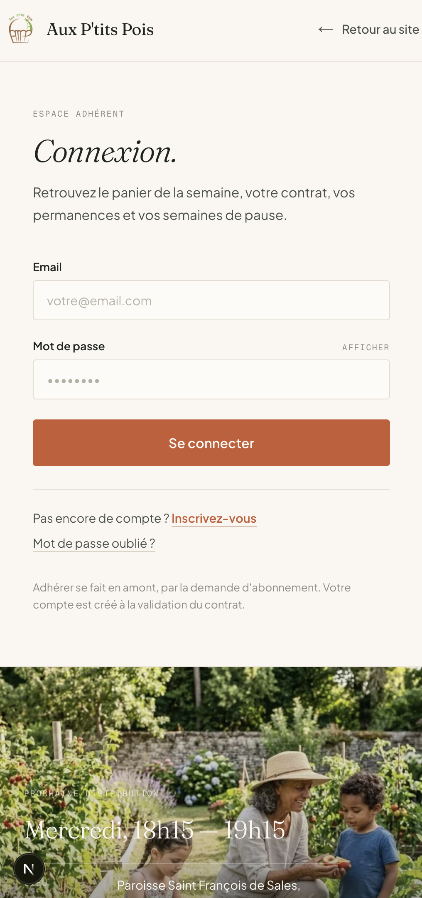
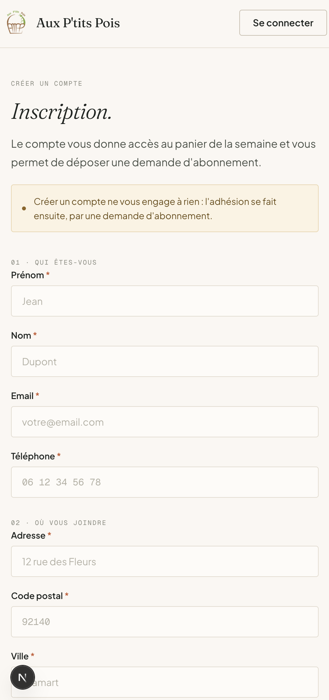

## 📋 Description

Ce projet est un site complet permettant de gérer une AMAP de A à Z :
- 🛒 Gestion des paniers hebdomadaires (création manuelle ou génération automatique)
- 👥 Gestion des adhérents, demandes et abonnements
- 🚜 Présentation des producteurs et des produits locaux
- 📅 Organisation des permanences de distribution et de l'émargement
- 📧 Communication avec les membres (newsletters, emails transactionnels)
- 🛡️ Journal d'audit des actions d'administration

## 🚀 Technologies utilisées

### Frontend
- **Next.js 15** (App Router) - Rendu côté serveur, sitemap et robots.txt natifs
- **React 18** - Interface utilisateur réactive
- **Lucide React** - Icônes modernes
- **CSS natif** - Variables CSS, design tokens, responsive (aucun framework utilitaire)
- **Tiptap 3** - Éditeur rich-text des newsletters (gras, italique, titres, listes, séparateur)
- **isomorphic-dompurify** - Sanitisation XSS du contenu HTML externe
- **Orejime 3** - Gestion du consentement cookies conforme RGPD

### Backend
- **Node.js + Express 4** - API REST (modules ESM)
- **Prisma 7** (+ `@prisma/adapter-pg`) - ORM et migrations
- **PostgreSQL** - Base de données relationnelle
- **JWT + bcryptjs** - Authentification par cookie httpOnly, révocable
- **Zod** - Validation des entrées avec schémas centralisés
- **Helmet + express-rate-limit** - Headers de sécurité et limitation de débit
- **Puppeteer + Handlebars** - Génération de contrats PDF
- **Nodemailer + Brevo SMTP** - Envoi d'emails transactionnels et newsletters
- **isomorphic-dompurify** - Sanitisation XSS des contenus utilisateur envoyés par email
- **TheMealDB API** - Base de données de recettes
- **google-translate-api-x** - Traduction automatique des recettes en français (sans clé API)

## 📁 Structure du projet

```
amap-website/
├── frontend/          # Application Next.js
│   ├── src/
│   │   ├── app/         # Pages, routes, sitemap.js, robots.js
│   │   │   └── admin/   # Espace d'administration (14 écrans)
│   │   ├── components/  # Composants (admin, auth, common, home, layout)
│   │   ├── constants/   # Icônes produits, listes de recettes, nombres en toutes lettres
│   │   ├── contexts/    # Contextes React (Auth, Modal, Theme)
│   │   ├── hooks/       # Hooks personnalisés (useFocusTrap)
│   │   ├── lib/         # Utilitaires (api.js, logger.js, format.js, closures.js)
│   │   ├── middleware.js # CSP nonce, HSTS, COOP, X-Frame-Options
│   │   └── styles/      # CSS (variables, globals, admin/, components/)
│   ├── scripts/         # copy-orejime.js (postinstall)
│   └── public/          # Assets statiques
│
└── backend/           # API Express
    ├── src/
    │   ├── config/       # Connexion Prisma / PostgreSQL
    │   ├── controllers/  # Logique métier (15 contrôleurs)
    │   ├── routes/       # Routes API
    │   ├── middlewares/  # Auth (cookie JWT), rôles, gestion d'erreurs
    │   ├── services/     # Email, contrats PDF, recettes, audit, clôtures, génération de paniers
    │   ├── jobs/         # Tâches planifiées (rappels, purge RGPD, panier auto)
    │   └── utils/        # Schémas Zod, erreurs HTTP, tarification, calendrier
    ├── templates/        # Gabarit Handlebars du contrat PDF
    ├── scripts/          # create-admin.js, extractLogo.js
    └── prisma/
        ├── schema.prisma  # Modèle de données
        ├── seed.js        # Jeu de données de démonstration
        ├── seed-safe.js   # Seed non destructif
        └── migrations/    # 21 migrations
```

## 🛠️ Installation

### Prérequis
- Node.js 18+
- PostgreSQL
- npm

### Étapes

1. **Cloner le projet**
```bash
git clone https://github.com/B-ludovic/amap-website.git
cd amap-website
```

2. **Installer toutes les dépendances**
```bash
npm run install:all
# Équivaut à npm install à la racine, dans frontend/ puis dans backend/
```

3. **Configuration Backend**
```bash
cd backend
cp .env.example .env
```

Variables attendues dans `backend/.env` :

| Variable | Rôle |
|---|---|
| `DATABASE_URL` | Chaîne de connexion PostgreSQL |
| `PORT` | Port de l'API (défaut : `4000`) |
| `NODE_ENV` | `development` ou `production` |
| `JWT_SECRET` | Secret de signature des tokens d'authentification |
| `BREVO_SMTP_USER` | Login SMTP Brevo (Settings → SMTP et API) |
| `BREVO_SMTP_KEY` | Clé SMTP Brevo |
| `EMAIL_FROM` | Adresse d'expédition des emails |
| `FRONTEND_URL` | URL du frontend (liens dans les emails + origine CORS autorisée) |

Puis initialiser la base :
```bash
npm run migrate            # npx prisma migrate dev
npm run seed               # optionnel : données d'exemple
# ou npm run seed:safe     # seed non destructif sur une base déjà remplie
```

4. **Configuration Frontend**

Créer `frontend/.env.local` :
```
NEXT_PUBLIC_API_URL=http://localhost:4000/api
NEXT_PUBLIC_GA_ID=              # optionnel, ID Google Analytics
```

> `NEXT_PUBLIC_API_URL` doit inclure le suffixe `/api` : le client concatène directement les chemins de routes (`/auth/login`, `/producers`…).

## 🏃 Lancement

### Mode développement

**Depuis la racine (recommandé) :**
```bash
npm run dev
# Lance le backend et le frontend en parallèle (concurrently)
```

**Ou manuellement :**

Terminal 1 - Backend :
```bash
cd backend
npm run dev
# API disponible sur http://localhost:4000/api
# Health check : http://localhost:4000/api/health
```

Terminal 2 - Frontend :
```bash
cd frontend
npm run dev
# Site disponible sur http://localhost:3000
```

### Mode production

```bash
# Backend
cd backend
npm run migrate:prod    # prisma migrate deploy
npm start

# Frontend
cd frontend
npm run build
npm start
```

## ☁️ Déploiement

Le projet est déployé en production sur :

- **Frontend → [Vercel](https://vercel.com)** : déploiement automatique depuis GitHub, HTTPS inclus.
  - URL : https://auxptitspois.fr
- **Backend + Base de données → [Render](https://render.com)** : service Web pour l'API Express et base PostgreSQL managée.
  - URL : https://api.auxptitspois.fr

### Variables d'environnement à configurer

**Sur Render (backend) :**
```
DATABASE_URL=...           # fournie automatiquement par Render PostgreSQL
JWT_SECRET=...
NODE_ENV=production
FRONTEND_URL=https://auxptitspois.fr
BREVO_SMTP_USER=...        # login SMTP Brevo (Settings → SMTP et API)
BREVO_SMTP_KEY=...         # clé SMTP Brevo
EMAIL_FROM=...             # adresse d'expédition
```

**Sur Vercel (frontend) :**
```
NEXT_PUBLIC_API_URL=https://api.auxptitspois.fr/api
NEXT_PUBLIC_GA_ID=...          # ID Google Analytics (ex: G-XXXXXXXXXX)
```

> Le cookie d'authentification est posé en `SameSite=Lax`. Une prévisualisation Vercel sur `*.vercel.app` est donc cross-site par rapport à l'API et perd la session : seuls les domaines listés dans les origines CORS (`auxptitspois.fr`, `www.auxptitspois.fr`, `FRONTEND_URL`, `localhost`) sont authentifiables.

> Sur Render en version gratuite, le backend se met en veille après 15 min d'inactivité. Première requête un peu lente, c'est normal.

## ✨ Fonctionnalités principales

### Pour les adhérents
- Inscription, connexion, réinitialisation de mot de passe, vérification d'email
- Demande d'abonnement en ligne (formule annuelle ou découverte, petit ou grand panier, tarif normal ou solidaire)
- Consultation du panier de la semaine avec horaire et adresse de retrait
- Suggestions et recherche de recettes basées sur les légumes du panier
- Inscription aux permanences de distribution, avec désistement encadré
- Visualisation des producteurs partenaires et de leurs fermes
- Gestion du profil
- Export des données personnelles (RGPD art. 20)
- Suppression du compte (RGPD art. 17)

### Pour les administrateurs
Espace dédié de 14 écrans, pagination unifiée sur toutes les listes :
- **Demandes d'abonnement** : validation, refus, rattachement au compte utilisateur, génération du contrat PDF pré-rempli (Puppeteer + Handlebars)
- **Abonnements** : activation, résiliation, pause individuelle (limite 2 semaines/an)
- **Fermetures** : fermetures collectives de l'AMAP (limite 3 semaines/an) avec newsletter automatique, contrôle de collision avec les permanences existantes
- **Panier hebdomadaire** : composition manuelle ou génération automatique depuis le catalogue saisonnier, publication avec notification email aux abonnés actifs (envoi par batch)
- **Distribution** : liste d'émargement, pointage optimiste des retraits, note par adhérent, statistiques, export CSV compatible Excel (UTF-8 BOM)
- **Permanences** : création, duplication, gestion des bénévoles inscrits
- **Producteurs / Produits** : fiches fermes, saisonnalité des produits, tailles de panier éligibles
- **Demandes producteurs** : traitement des candidatures avec emails d'acceptation/refus
- **Communication** : newsletters rich-text (Tiptap), envoi groupé, programmation, brouillons
- **Messages** : boîte de réception du formulaire de contact (lu / non-lu / archivé)
- **Utilisateurs** : gestion des comptes et des rôles
- **Journal** : journal d'audit des actions sensibles, filtrable par sévérité
- **Paramètres** : thèmes saisonniers et personnalisation des couleurs
- **Tableau de bord** : statistiques de l'association

### Automatisations
Trois tâches tournent avec le serveur, sans planificateur externe :
- **Rappel de renouvellement** : email aux abonnés dont le contrat expire dans 30 jours (une seule fois par abonnement)
- **Purge RGPD** : suppression définitive des comptes supprimés depuis 90 jours et des inscriptions non vérifiées depuis 30 jours, en transaction et sur prédicat relationnel (un compte restauré entre-temps échappe à la purge)
- **Génération du panier** : chaque jeudi à 2h (Europe/Paris) pour la distribution du mercredi suivant, tirage dans le catalogue de la saison en cours, sautée si une fermeture couvre la semaine

### Recettes & Cuisine
- Intégration API TheMealDB avec traduction automatique en français (google-translate-api-x)
- Dictionnaire de faux amis FR→EN pour les légumes courants (courgette→zucchini, etc.)
- Priorité aux recettes françaises dans tous les résultats (recherche et suggestions panier)
- Recherche par nom ou par ingrédients
- Pilules légumes saisonnières cliquables (Printemps / Été / Automne / Hiver) avec icônes SVG OpenMoji
- Pages dédiées avec liste et détail des recettes

### Design & Sécurité
- Design responsive (desktop, tablet, mobile) avec thèmes saisonniers dynamiques
- **Authentification par cookie `httpOnly`** (`SameSite=Lax`, `Secure` en production, 7 jours), invisible du JavaScript client
- **Révocation de session** : un compteur `tokenVersion` en base invalide instantanément tous les tokens émis (changement de rôle, réinitialisation de mot de passe)
- Protection des routes par rôle (MEMBER, VOLUNTEER, ADMIN)
- **Protection CSRF** par `SameSite=Lax`, corps JSON exclusif (100 ko max) et liste blanche d'origines CORS explicite
- Rate limiting différencié : global (300/15 min), authentification (10/15 min), formulaires publics (10/15 min), génération PDF (5/min), routes admin (200/15 min)
- Headers sécurisés côté API (Helmet.js) et sanitisation XSS (DOMPurify) côté front comme back
- **CSP nonce-based** via middleware Next.js (`script-src 'nonce' 'strict-dynamic'`, `'unsafe-eval'` retiré en production)
- **HSTS** (`max-age=31536000; includeSubDomains; preload`), **COOP** (`same-origin`), **X-Frame-Options** (`DENY`), `nosniff`, `Referrer-Policy`
- JSON-LD sécurisé : échappement `<`, `>`, `&` dans les scripts structurés
- **Journal d'audit** : 33 actions d'administration tracées (acteur, cible, IP, détails JSON, sévérité CRITICAL / IMPORTANT), l'échec du log ne fait jamais échouer l'action métier
- Visiteurs anonymes : pas de requête `/auth/me` (flag `localStorage`) → zéro 401 en console
- Erreurs API remontées telles quelles à l'utilisateur, y compris l'échec réseau (« Serveur injoignable »)
- Gestion du consentement cookies conforme RGPD (Orejime)
- SEO : sitemap, robots.txt (noindex admin + blocage bots IA), `generateMetadata` dynamique sur les recettes, JSON-LD Organization + FAQPage + ItemList producteurs, lazy loading images

## 📊 Base de données

Le schéma Prisma comprend :

**Adhérents & abonnements**
- **User** - Utilisateurs (MEMBER, VOLUNTEER, ADMIN), suppression logique et `tokenVersion`
- **SubscriptionRequest** - Demandes d'abonnement
- **Subscription** - Abonnements (ANNUAL / DISCOVERY, SMALL / LARGE, tarif NORMAL / SOLIDARITY)
- **SubscriptionPause** - Pauses individuelles (limite 2 semaines/an)
- **AmapClosure** - Fermetures collectives (limite 3 semaines/an)
- **Payment** - Suivi des paiements (statut, méthode)

**Paniers & distribution**
- **WeeklyBasket** / **WeeklyBasketItem** - Paniers hebdomadaires et leur contenu figé
- **WeeklyPickup** - Suivi des retraits (émargement)
- **PickupLocation** - Points de retrait
- **Shift** / **ShiftVolunteer** - Permanences et bénévoles inscrits

**Catalogue**
- **Producer** - Producteurs locaux (certification, détails de la ferme)
- **Product** - Produits, saisons et tailles de panier éligibles
- **ProducerInquiry** - Candidatures de producteurs
- **Recipe** / **RecipeProduct** - Recettes et légumes associés

**Administration**
- **Newsletter** - Communications (type, cible, programmation)
- **ContactMessage** - Messages de contact
- **AuditLog** - Journal d'audit des actions d'administration
- **ThemeConfig** - Configuration du thème actif

## 🎨 Personnalisation

Les administrateurs peuvent choisir parmi 4 thèmes saisonniers prédéfinis (Printemps, Été, Automne, Hiver) et personnaliser leurs couleurs. Les thèmes sont stockés en base de données et appliqués dynamiquement via le `ThemeProvider` React.

Les couleurs et styles sont centralisés dans `frontend/src/styles/variables.css`.

## 📝 Scripts disponibles

### Racine
- `npm run dev` - Lance le backend et le frontend en parallèle
- `npm run install:all` - Installe les dépendances des trois espaces
- `npm run build:frontend` / `npm run start:backend` / `npm run start:frontend`

### Backend
- `npm run dev` - Serveur en mode développement (nodemon)
- `npm start` - Serveur en production
- `npm run migrate` - Crée une nouvelle migration (`prisma migrate dev`)
- `npm run migrate:prod` - Applique les migrations en production (`prisma migrate deploy`)
- `npm run generate` - Régénère le client Prisma
- `npm run studio` - Interface graphique de la base
- `npm run seed` / `npm run seed:safe` - Données d'exemple (destructif / non destructif)
- `node scripts/create-admin.js` - Crée le premier compte admin en production
- `node prisma/migrate-theme-colors.js` - Met à jour les couleurs de thème en base (WCAG AA)

### Frontend
- `npm run dev` - Next.js en développement
- `npm run build` - Build de production
- `npm start` - Serveur de production
- `npm run lint` - ESLint
- `npm run postinstall` - Copie les fichiers Orejime dans `public/` (automatique après `npm install`)

## 🐛 Débogage

**Problème de connexion à la DB :**
- Vérifiez que PostgreSQL est démarré
- Vérifiez la variable `DATABASE_URL` dans `.env`

**Erreurs CORS :**
- Vérifiez que `FRONTEND_URL` dans `backend/.env` correspond exactement à l'URL du frontend (schéma et sous-domaine compris)

**Session perdue à chaque rechargement :**
- Le cookie est `SameSite=Lax` : front et API doivent être sur le même site. Une URL de prévisualisation Vercel ne peut pas rester connectée.
- En local, vérifiez que `NEXT_PUBLIC_API_URL` pointe bien sur `http://localhost:4000/api` et non sur un domaine distant.

**Erreurs d'authentification :**
- Vérifiez que `JWT_SECRET` est défini dans `.env`
- Un changement de rôle ou une réinitialisation de mot de passe incrémente `tokenVersion` et invalide volontairement les sessions ouvertes

**Emails non reçus :**
- Vérifiez `BREVO_SMTP_USER`, `BREVO_SMTP_KEY` et `EMAIL_FROM`
- L'adresse `EMAIL_FROM` doit être validée comme expéditeur dans Brevo

## 📄 Licence

Ce projet est développé pour une AMAP locale. Tous droits réservés.

## Crédits

- **Icônes légumes** : [OpenMoji](https://openmoji.org) — licence [CC BY-SA 4.0](https://creativecommons.org/licenses/by-sa/4.0/)
- **Icônes UI** : [Lucide React](https://lucide.dev)

---

Fait avec ❤️ pour promouvoir l'agriculture locale et les circuits courts

Ludovic
